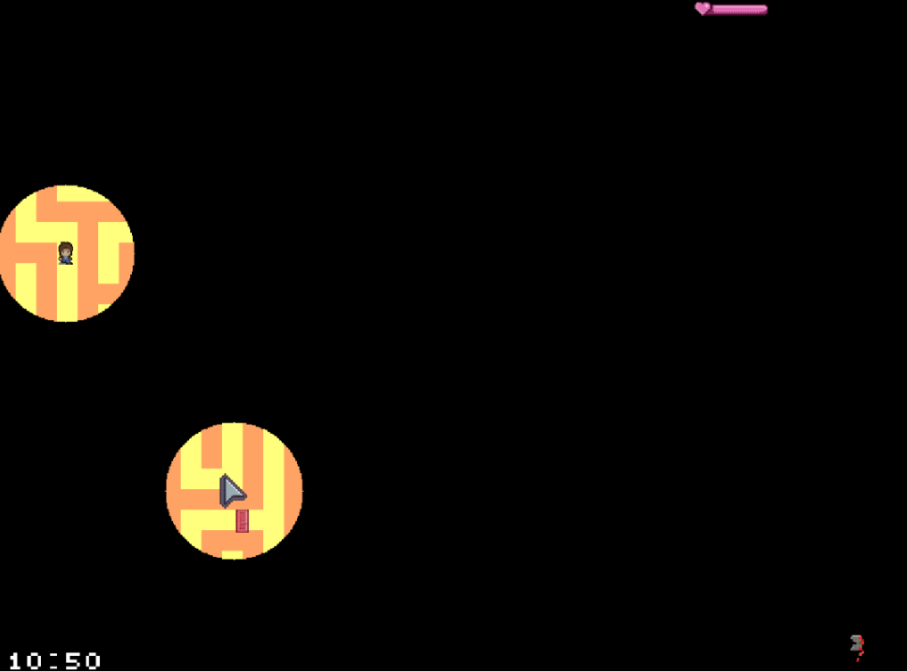

# 🖥️ LCOM Project

LCOM Project for group T04 G04.

## 👥 Group members:

1. Beatriz Bernardo (up202206097@up.pt)
2. Diana Nunes (up202208247@up.pt)
3. Sofia Gonçalves (up202205020@up.pt)
4. Teresa Mascarenhas (up202206828@up.pt)

## 🎮 Game Overview 

**Lab-rinth** is a 2D game where the main objective is to escape from a maze within a set time limit. The player uses a lantern to visualize the map, navigating through corridors and trying to discover buttons that unlock specific doors scattered along the way, all while searching for the exit. 

### ⚔️ Game Modes

- **Singleplayer Mode**: 
  - The player explores the maze alone, using the lantern to light the path and find the exit before time runs out.

- **Cooperative Mode**: 
  - Two players play simultaneously in the same maze. They must cooperate to find the exit but with the added tension of competing to see who reaches it first. Both players share the same goal but must balance cooperation with competition to ensure they escape the maze before their opponent.

## 🌟 Features

- **2D Maze Navigation**: Explore a detailed maze filled with challenges.
- **Lantern Mechanics**: Use the lantern to light your way and reveal hidden paths.
- **Unlockable Doors**: Find buttons that unlock various doors to progress through the maze.
- **Singleplayer and Cooperative Modes**: Choose to play solo or with a friend, enhancing the gameplay experience.
- **Time Challenge**: Race against the clock to escape the maze.

## ⚙️ Installation

To run the game:

1. Download the game files.
2. Extract the contents to your desired directory.
3. Open the game launcher and start playing!

## 🎮 GamePlay

**Enjoy escaping the maze!** 🌌🔦
